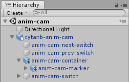
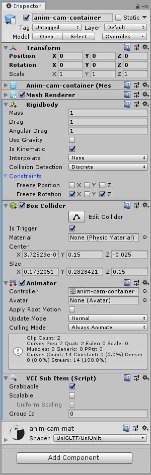
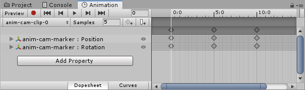
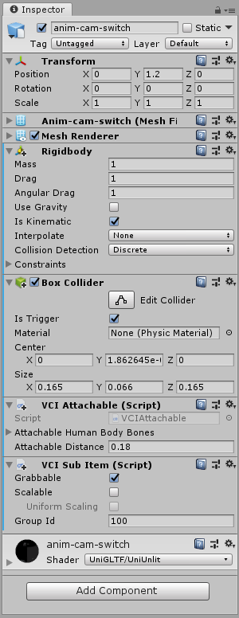

# cytanb-anim-cam

- アニメーションでカメラを動かすための、VCI のテンプレートです。
- PV 撮影など、カメラワークを事前に作っておく場合に使えるかもしれません。
- Unity 上でカメラ追従用のオブジェクトに対して、アニメーションを作成して利用します。
- 試作段階につき、予告なく機能更新されることがあります。
- 間違いや使いづらい点などがございましたら、適宜修正してお使いください。

## 紹介動画

## オブジェクトの階層構造

### 階層

### `cytanb-anim-cam`: ルートオブジェクト

- `VCI Object` のアイテム情報を適宜変更します。

- [anim-cam-main.lua](scripts/anim-cam-main.lua) ファイルを、`VCI Object` コンポーネントのスクリプトとして指定します。

- [conf](scripts/anim-cam-main.lua) 変数を編集することで、カメラ、アニメーション、オブジェクトの構成に合わせてカスタマイズすることができます。複数のアニメーションを連続再生したり、VCI を設置すると同時に、再生開始するように設定することもできます。詳細はスクリプトファイルをご覧ください。

### `anim-cam-container`: カメラマーカーのコンテナーオブジェクト

- アニメーションを行うためのコンポーネントを追加しています。VCAS 1.7.2a で導入された仕組みを利用します。

- `VCI Sub Item`, `Rigidbody`, `Collider` コンポーネントを追加しています。アニメーションの基準位置を、サブアイテムをつかんで移動できるようになります。サブアイテムをつかめないようにしておく場合は、`VCI Sub Item` コンポーネントの `Grabbable` をオフにします。また、酔い対策で `Freeze Rotation` による制限をかけていますが、オフにすることで、自由に回転させることができます。

### `anim-cam-marker`: カメラマーカーオブジェクト

- カメラを追従させるためのマーカーオブジェクトです。

- このオブジェクトを、アニメーションで位置と回転を変化させると、スクリプトがカメラの位置と回転を合わせるようになっています。

- ユーザーごとにローカルで処理するため、`VCI Sub Item` コンポーネントは付けません。

### `anim-cam-switch`: カメラアニメーションの再生・停止の切り替えスイッチ

- グリップすることで、カメラアニメーションの再生・停止の切り替えを行います。

- `VCI Sub Item`, `Rigidbody`, `Collider` コンポーネントが必要です。

- `anim-cam-next-switch`, `anim-cam-prev-switch` スイッチと同じ `Group Id` に設定します。

- 装着できるようにする場合は、`VCI Attachable` コンポーネントを追加することができます。

### `anim-cam-next-switch`, `anim-cam-prev-switch`: 次・前のカメラアニメーションへの切り替えスイッチ

- [conf.directives](scripts/anim-cam-main.lua) 変数に、複数のアニメーションを登録している場合に、切り替えを行うためのスイッチです。

- グリップして使用したスイッチを判定するためのオブジェクトなので、透明にしています。

## Download

- [Unity package](https://www.dropbox.com/s/1u2mh7feav0zxl6/cytanb-anim-cam-latest.unitypackage?dl=1)

- [Unity](https://unity3d.com/), [VCI](https://github.com/virtual-cast/VCI), および `TextMesh Pro` が必要になります。
